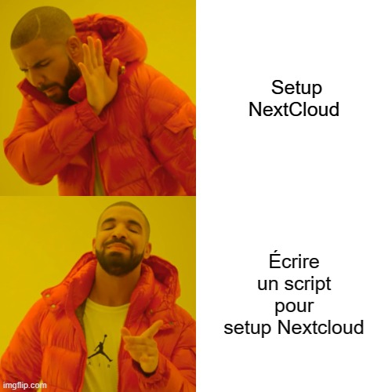

# Module 6 : Automatiser le déploiement

**IMPORTANT** : Avoir le script, et le fichier [.nextcloud.conf.skeleton](.nextcloud.conf.skeleton) sur la machine.

**[GOD Script](./tp3_automation_nextcloud.sh)**
